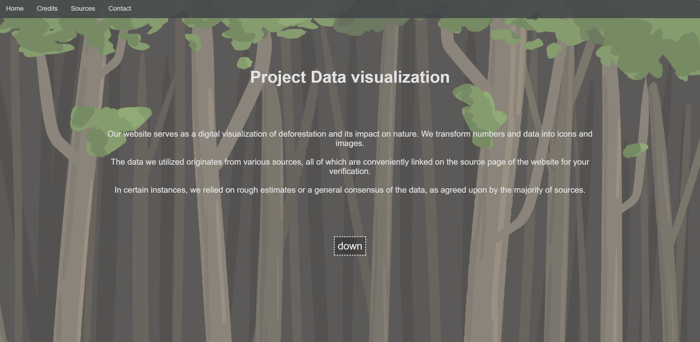
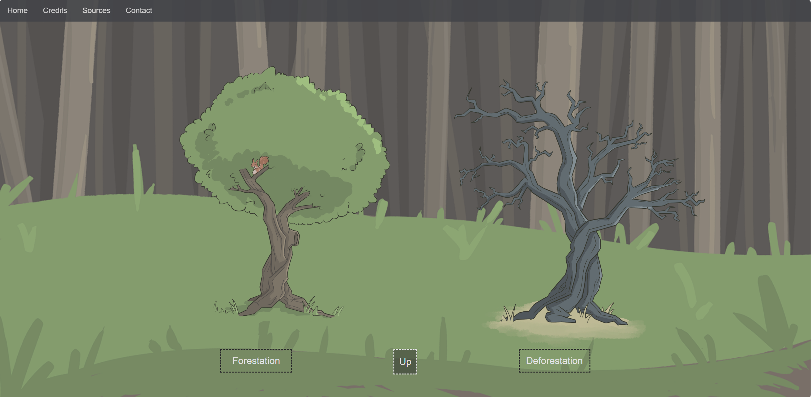
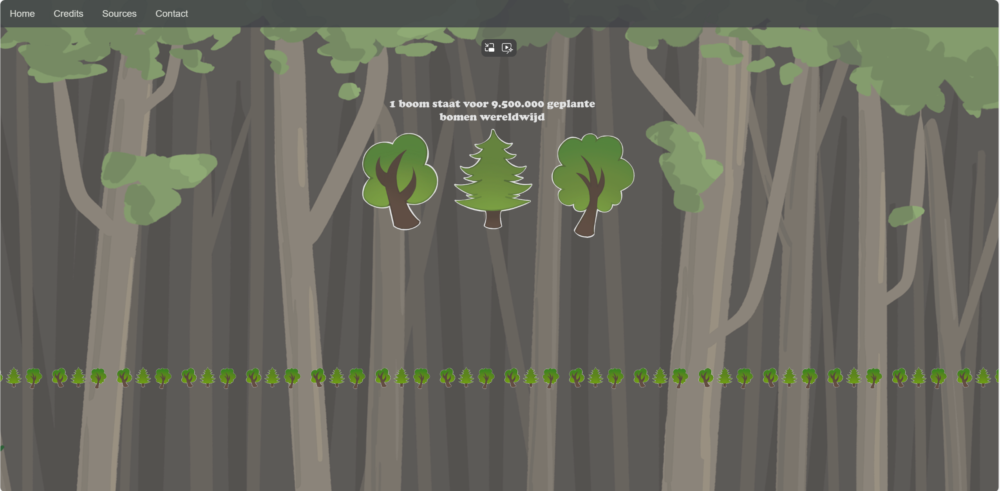
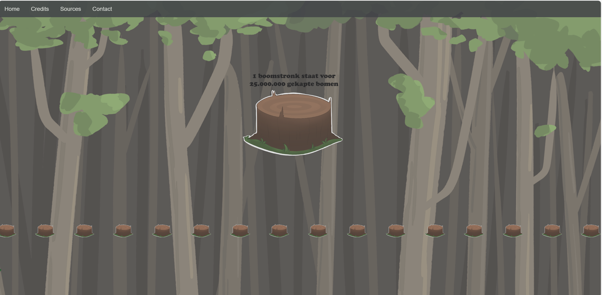
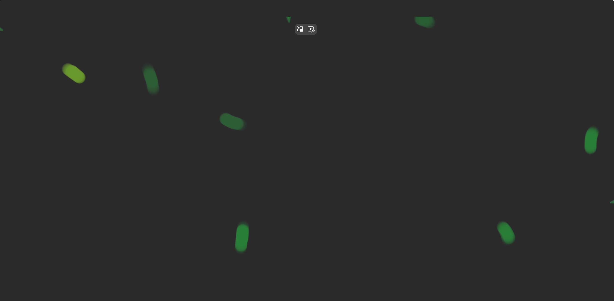
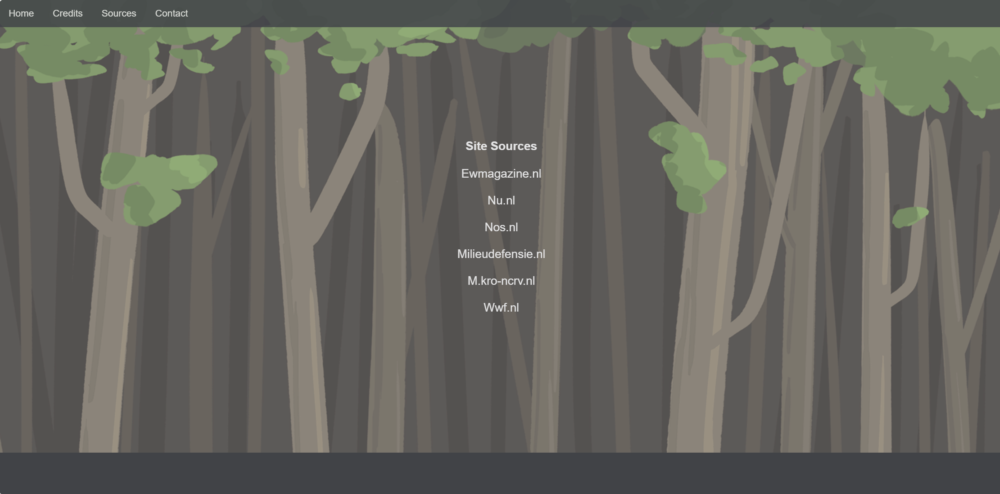
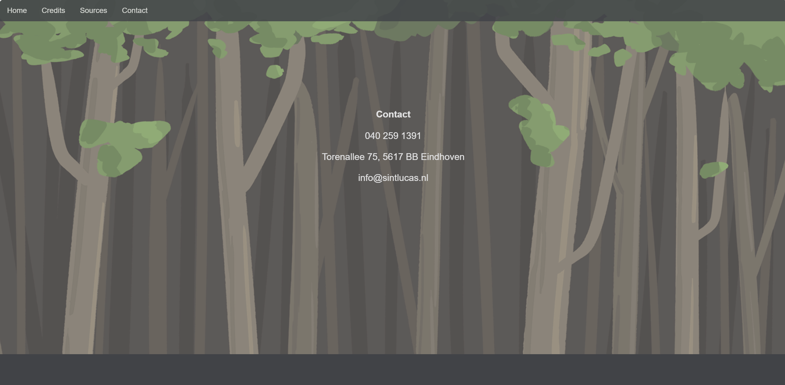

# Dutch_translation_Project_Data_Visualization

### Where to find English translation

You can either scroll down or click here: [English_Project_Data_Visualization](#English_translation_Project_Data_Visualization)

        

## Credits:

Dit project was een multidisciplinaire onderneming, waarbij studenten uit minstens twee verschillende studierichtingen betrokken waren die samenwerkten om het eindproduct te maken.

In dit geval waren dat:
- DDM (Digital Design & Motion)
- SD (Software Development)

  

De artwork is gemaakt door DDM, bestaande uit:
Arwen Raven, Rik van der Avoird en Anne Wieringa.

De code is ontwikkeld door SD, met onder andere:
Martijn van der Willigen en Baran Günebakan.

Martijn van der Willigen was de projectleider van de groep en het onderzoek was een teamprestatie.

  

Deze versie van de website is door Martijn van der Willigen aangepast om hem toonbaar te maken voor zijn portfolio en wijkt enigszins af van het origineel.

        

## Bronvermeldingen:

Hier kun je alle websites bekijken die zijn gebruikt om conclusies te trekken uit onze statistieken:

- Ewmagazine.nl
- Nu.nl
- Nos.nl
- Milieudefensie.nl
- M.kro-ncrv.nl
- Wwf.nl

        

## Het proces en doel:

Onze school trad op als klant. Onze klant wilde een game, website of app die gegevens met visuals zou weergeven op basis van een vooraf gekozen onderwerp uit een selectie van onderwerpen die al door onze school gekozen waren.

Ons team koos uiteindelijk het milieu als onderwerp. Het was nog steeds een breed onderwerp, dus beperkten we het tot jaarlijks geplante bomen wereldwijd versus jaarlijks gekapte bomen wereldwijd.

  

Ons team kwam al vroeg tot de conclusie dat een website de beste manier was, omdat een interactieve website onze feiten zo efficiënt mogelijk kon weergeven.

Dit werd ook ondersteund door het feit dat Baran Günebakan de voorkeur gaf aan webontwikkeling, terwijl Martijn van der Willigen er open voor stond.

  

Baran Günebakan maakte de wireframe om ons team een idee te geven van hoe de website eruit zou komen te zien, en we bouwden de website volgens deze blauwdruk.

  

Ons team communiceerde ook via Discord om in contact te blijven over ons project.

Het onderzoek werd in teamverband gedaan aan de hand van websites en het controleren van geloofwaardige bronnen, en de bevindingen werden verzameld in onze Discord-groep.

        

## De website:

  

De eerste helft van de “Home Page”

    

De tweede helft van de “Home Page”

    

De “Forestation Page” toont het aantal bomen dat wereldwijd jaarlijks wordt geplant.

    

De “Deforestation Page” toont het aantal bomen dat jaarlijks wereldwijd wordt gekapt.

    

Het eerste frame van de animatie wordt afgespeeld wanneer je overschakelt naar de pagina "Forestation" / "Deforestation."

    

Het tweede frame van de animatie wordt afgespeeld wanneer je overschakelt naar de pagina "Forestation" / "Deforestation."

    

Dit is de “Credits Pagina” waar alle artiesten en ontwikkelaars, zoals ikzelf, credits krijgen.

    

Dit is de “Bronnenpagina”, de pagina waar de websites worden vermeld die voor het onderzoek zijn gebruikt.

    

Dit is de “Contactpagina”; hier vind je de gegevens om contact op te nemen met “Sint Lucas Eindhoven.”

        

## Terugblik:

Ondanks het gebrek aan ervaring van ons team op dat moment en de snel naderende deadline, ben ik echt trots op wat we hebben neergezet.

                                

# English_translation_Project_Data_Visualization

### Where to find English translation

You can either scroll up or click here: [Dutch_Project_Data_Visualization](#Dutch_translation_Project_Data_Visualization)

        

## Credits:

This project was a multidisciplinary endeavor, involving students from at least two different fields of study who collaborated to create the final product.

In this case, the fields were:
- DDM (Digital Design & Motion)
- SD (Software Development)

  

The art was created by DDM, which included:
Arwen Raven, Rik van der Avoird, and Anne Wieringa.

The code was developed by SD, which included:
Martijn van der Willigen and Baran Günebakan.

Martijn van der Willigen was the project leader of the group, and the research was a team effort.

  

This version of the website was modified by Martijn van der Willigen to make it presentable for his portfolio and is moderately different from the original.

        

## source credits:

Here you can see all the websites used to draw the conclusions of our statistics:

- Ewmagazine.nl
- Nu.nl
- Nos.nl
- Milieudefensie.nl
- M.kro-ncrv.nl
- Wwf.nl

        

## The process and goal:

Our school acted as a client. Our client wanted a game, website or app that would display data with visuals based on a pre-chosen topic from a selection of topics already chosen by our school.

Our team ended up choosing the environment as the topic. It was still a wide subject, so we narrowed it down to annual trees planted worldwide vs. annual trees cut down worldwide.

  

Our team concluded early on that a website was the best way to go, as an interactive website could display our facts as efficiently as possible.

This was also supported by the fact that Baran Günebakan preferred web development, while Martijn van der Willigen was open-minded.

  

Baran Günebakan created the wireframe to give our team an idea of how the website would look, and we proceeded to build it according to this blueprint.

  

Our team communicated via Discord to stay in contact about our project.

The research was done as a team through websites and fact-checking credible sources, and the findings were collected in our Discord group.

        

## The website:

  

The first half of the "Home Page"

    

The second half of the "Home Page"

    

The "Forestation Page" displays the number of trees planted worldwide on an annual basis.

    

The "Deforestation Page" displays the number of trees cut down worldwide on an annual basis.

    

The first frame of the animation plays when you switch to the "Forestation" / "Deforestation" page.

    

The second frame of the animation plays when you switch to the "Forestation" / "Deforestation" page.

    

This is the "Credits Page" where all artists and developers, like myself, receive credit.

    

This is the "Sources Page," the page where the websites used for research are mentioned.

    

This is the "Contact Page"; it's where you'll find the details to contact "Sint Lucas Eindhoven."

        

## Retrospective:

Despite our team's lack of experience at the time and the fast-approaching deadline, I'm really proud of what we put together.
