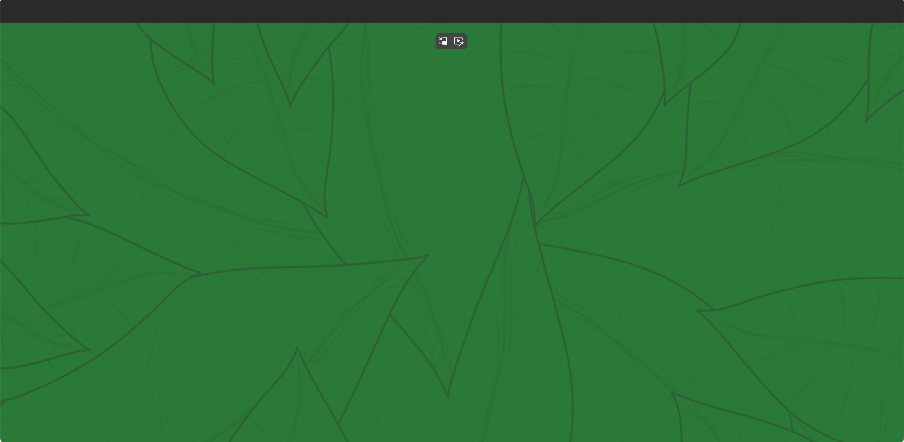

# Dutch_translation_Data_display_website

### Where to find English translation

You can either scroll down or click here: [English_Data_display_website](#English_translation_Data_display_website)

        

## credits:

                

# English_translation_Data_display_website

### Where to find English translation

You can either scroll up or click here: [Dutch_Data_display_website](#Dutch_translation_Data_display_website)

        

## credits:

This project was a multidisciplinary project, meaning students from at least two different studies worked to create the final product.

In this case it was:
- DDM or Digital Design & Motion.
- SD or Software Development

  

The art was made by DDM which included:
Arwen Raven, Rik van der Avoird, and Anne Wieringa.

The code was made by SD which included: 
Martijn van der Willigen and Baran Günebakan.

Martijn van der Willigen was the project leader of the group and the research was done as a team effort.

  

This version of the website was Changed by Martijn van der Willigen to make it representable for his Portfolio and is moderately different from the original.

        

## source credits:

Here you can see all websites used to pull the conclusions of our statistics:

Ewmagazine.nl

Nu.nl

Nos.nl

Milieudefensie.nl

M.kro-ncrv.nl

Wwf.nl

        

## The proces and goal:

Our school was acting as the client, our client wanted a game/website/app that would display Data with visuals based on any pre selected subject they had chosen.

Our team ended up choosing environment as topic it was still a wide subject, so we narrowed it down to annual trees planted world wide vs annual trees cut down world wide.

  

Our team had come early to the conclusion that Website was the best way to go about it as a interactive website could display our facts as efficiently as possible.

This was also being supported by the fact that Baran Günebakan preferred Web development while Martijn van der Willigen was open minded.

  

The research was done as a team via websites and fact checking for credible sources and collected in a Discord group.

Our team also communicated via Discord to keep in contact about our project.

  

Baran Günebakan made the wireframe to give Our team an idea of how the website would look like and we proceeded to built it by blueprint.

        

## The website:

Here will be shown what the website looked like. 

  

First half of the "Home Page"

    

Second half of the "Home Page"

    

The "Forestation Page" displaying the amount of trees planted world wide on a annual basis.

    

The "Deforestation Page" displaying the amount of trees cut down world wide on a annual basis.

    

The first frame of the animation that plays when you switch to the "Forestation" / "Deforestation" page.

    

The second frame of the animation that plays when you switch to the "Forestation" / "Deforestation" page.

    

This is the "Credit Page" where all artist and developers like myself get credit.

    

This is the "Sources Page", the page where the websites used for research are mentioned.

    

This is the "Contact Page" this is where you find the Details to contact "Sint Lucas Eindhoven".

        

## Retrospective:

Besides that our team not being very experienced and the deadline being fast i'm really proud of what our team put together:
